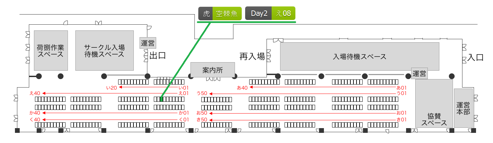
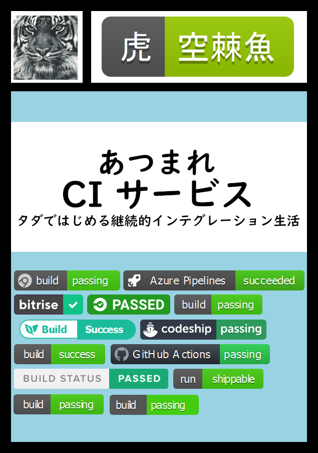

# techbookfest8


[](https://github.com/srz-zumix/techbookfest8/actions?query=workflow%3A%22GitHub+Actions%22)

## 技術書典 応援祭

[技術書典 応援祭](https://techbookfest.org/product/4931278088437760)

```
虎空棘魚は「#技術書典 応援祭」に参加します。

「あつまれ CI サービス　タダではじめる継続的インテグレーション生活」と題して、
過去6年間で使ってきた「無料で使える CI サービス」の中から厳選した 13 サービスを一冊にまとめました。
よろしくお願いするだなも！
```

[https://twitter.com/srz_zumix/status/1234811945175240705](https://twitter.com/srz_zumix/status/1234811945175240705)

### 推し祭

```
虎空棘魚「あつまれ CI サービス　タダではじめる継続的インテグレーション生活」

過去6年間で使ってきた「無料で使える CI サービス」の中から厳選した 13 サービスを一冊にまとめました。
よろしくお願いするだなも！

#技術書典 #推し祭出展者の陣 @techbookfest https://techbookfest.org/product/4931278088437760
```

[https://twitter.com/srz_zumix/status/1241684086176927745](https://twitter.com/srz_zumix/status/1241684086176927745)

## 技術書典8 （中止）

[技術書典8](https://techbookfest.org/event/tbf08)





## Build

### Local

> docker run --rm -v $PWD:/work kauplan/review2.5 /bin/bash -c "cd /work; rake preproc pdf;"
